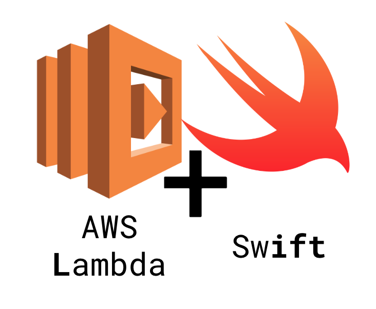

<p align="center">
  
</p>

# Overview

...writing.

# Installation

...writing.

# Prerequisites

...writing.

# Usage

### Runtime

First, you have to create an `AWS Lambda Layer` to wrap the Swift runtime on the instance runned by AWS Lambda. lift provides you a tool to easily create this layer.

```sh
$> lift create-runtime
```

This tool bundles a Swift runtime wrapper, using a linux Docker image, in a local zip file. You have to deploy this layer on your aws account, with the aws-cli commands provided in the command tool result.

Optional: You can specify another docker image with the `--image` option in the command line arguments. `swift:5.0` is the default used image.

### Create a swift lambda

...writing.

```sh
$> lift build-function --path /my/project/path
```
